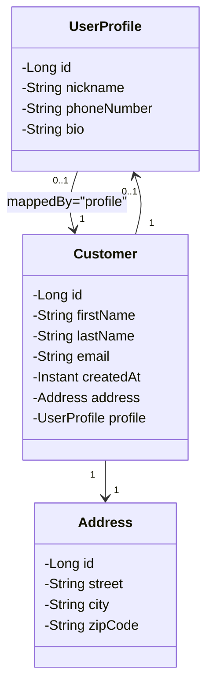
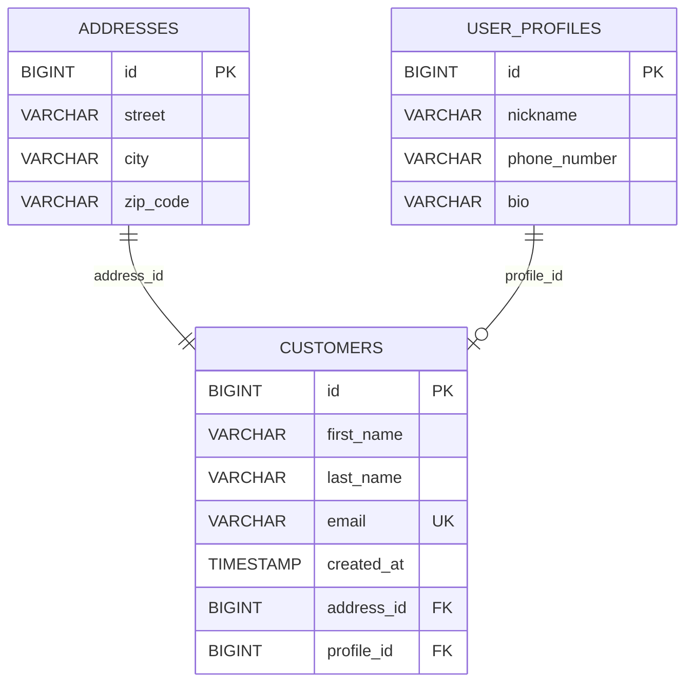

# Workshop: E-commerce Platform JPA (Part 1)

## Objective

Build the foundation of an E-commerce system focusing on **One-to-One relationships**.

## Project Setup & Dependencies

To start this project, ensure the `pom.xml` includes the following dependencies:

1. **Spring Data JPA**: `spring-boot-starter-data-jpa`
2. **Spring Web**: `spring-boot-starter-web`
3. **Spring Validation**: `spring-boot-starter-validation`
4. **Spring Boot DevTools**: `spring-boot-devtools` (optional)
5. **H2 Database**: `h2` (for testing)
6. **MySQL Driver**: `mysql-connector-j` (for production/development)
7. **Lombok**: `lombok`

Before coding the entities:

1. Initialize the git repository (if not done).
2. Commit the setup files (`pom.xml`, workshop files).
3. **Run the Application**: Verify that the application starts without errors and the database connection is successful.
4. **Push** the changes to GitHub.
5. **Share the Link**: Provide the repository URL to your instructor for initial review.

## Domain Model: Core Entities

In Part 1, the focus is on the relationship between a Customer and their secondary data:

- **Customer**: The primary user entity.
- **Address**: Shipping/Billing information.
- **UserProfile**: Additional details like bio, avatar, and phone number.

---

## Class Diagram (UML / Java View)

This diagram focuses on the class structure and the ORM relationship directions.

---

## Entity Diagram (ER / Database View)

This diagram shows tables + foreign keys.

## ORM Mapping

Map the classes to database tables using JPA annotations. Apply the appropriate annotations according to the requirements below.

### 1. Address Entity (Unidirectional)

- **Task**: Map the `Address` class to a table named `addresses`.
- **Requirements**:
    - Configure the `id` as a primary key with an identity generation strategy.
    - Ensure `street`, `city`, and `zipCode` are mandatory (not nullable) in the database.
- **Relationship**: Note that this is a standalone entity in terms of mapping; it doesn't need to reference the
  `Customer`.

### 2. UserProfile Entity

- **Task**: Map the `UserProfile` class to a table named `user_profiles`.
- **Requirements**:
    - Configure the `id` as a primary key with an identity generation strategy.
    - `nickname` and `phoneNumber` should be mandatory and have a maximum length of 100.
    - `bio` should allow up to 500 characters.
- **Optional: Relationship**:
    - Link this entity back to the `Customer` entity.
    - **Requirement**: Make this the **inverse side** of the bidirectional relationship using the `mappedBy` attribute.

### 3. Customer Entity (Owner Side)

- **Task**: Map the `Customer` class to a table named `customers`.
- **Requirements**:
    - Configure the `id` as a primary key with an identity generation strategy.
    - `firstName` and `lastName` should be mandatory (length 100).
    - `email` must be mandatory, unique, and have a maximum length of 150.
    - `createdAt` must be set when the customer is persisted.

- **Relationships**:
    - **Address**: Implement a **Unidirectional One-to-One** relationship. The foreign key column should be named
      `address_id` (**mandatory**).
    - **UserProfile**: Implement a **Bidirectional One-to-One** relationship (Optional). This is the **owner side**. The
      foreign key column should be named `profile_id`.
- **Optional: Cascading & Lifecycle**:
    - Configure both relationships so that persistence operations (like save and delete) propagate from `Customer` to
      the associated entities.
    - Ensure that if an associated entity is removed from the `Customer`, it is also deleted from the database (orphan
      removal).

## Repository Layer Requirements

Create the repository interfaces for the entities.  
Each interface should extend `JpaRepository` and include the specified query methods.

You are expected to use:

- Spring Data query method naming
- Derived queries
- Optional custom queries (if needed)

---

### 1. CustomerRepository

#### Required Queries

- Find a customer by their unique email.
- Find customers by last name (case-insensitive).
- Find customers living in a specific city.

#### Optional / Advanced Queries

- Find customers whose email contains a given keyword.
- Find customers created after a specific date.
- Find customers created between two dates.
- Count how many customers live in a specific city.
- Check if a customer exists by email.

---

### 2. UserProfileRepository

#### Required Queries

- Find a profile by nickname.
- Search for profiles by a partial phone number.

#### Optional / Advanced Queries

- Find profiles where bio is not null.
- Find profiles by nickname starting with a prefix.
- Find profiles created after a specific date (if applicable).
- Count profiles with a specific phone number prefix.

---

### 3. AddressRepository

#### Required Queries

- Find all addresses in a specific zip code area.

#### Optional / Advanced Queries

- Find all addresses in a specific city.
- Find addresses by street name.
- Count how many customers live in a given zip code.
- Find addresses where zip code starts with a prefix.

---

## Submission Checklist

- [ ] **Git Branch**: Create a feature branch for Part 1 (e.g., `feature/jpa-part1`).
- [ ] **Entities**: Map the required entities, including their One-to-One relationships.
- [ ] **Repositories**: Create the necessary repository interfaces with all required query methods.
- [ ] **Verification**: Run the application and ensure the database schema is generated correctly.
- [ ] **Commits**: Make descriptive commits for each major step.
- [ ] **Push**: Push the branch to GitHub and provide the link.

