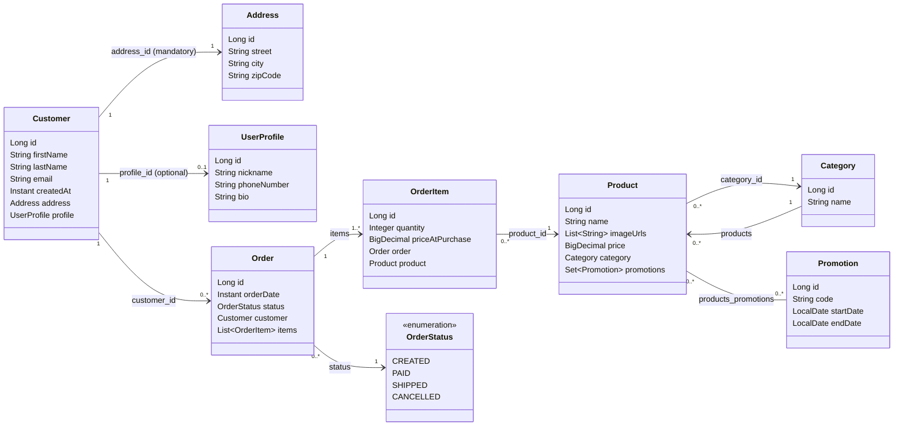
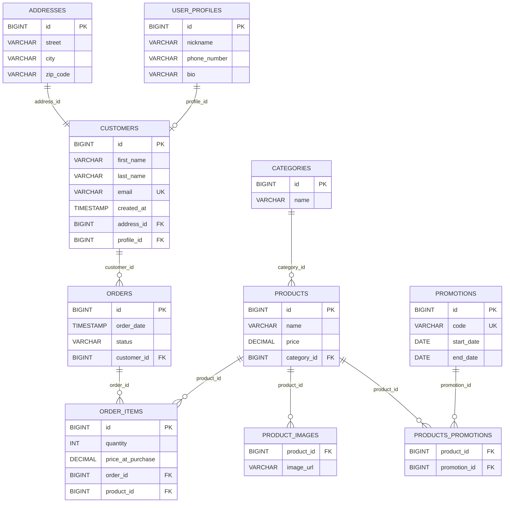

# Workshop: E-commerce Platform JPA (Part 2)

## Objective

Extend the E-commerce system to handle Catalog management, transactions, and many-to-many promotional relationships.

## Project Setup & Verification

This section continues from **Part 1**. Before coding the entities and relationships:

1. **Create a new branch for Part 2**
2. **Run the application** – Verify that the application starts without errors and that the database connection is successful.

## Domain Model: Catalog & Transactional Entities

In Part 2, the product catalog and the ordering process are introduced:

- **Category**: Product grouping (Electronics, Books, etc.).
- **Product**: Items available for sale.
- **Promotion**: Discounts that can apply to many products (with an active date range).
- **Order**: A completed purchase placed by a customer.
- **OrderItem**: A specific product in an order with price and quantity.
- **OrderStatus**: The state of an order (e.g., `CREATED`, `PAID`, `SHIPPED`, `CANCELLED`).

> **Note**: `Customer` is defined in Part 1 and is reused here. Each `Order` belongs to exactly one `Customer`.

## Class Diagram (UML)

This diagram illustrates the Java class structure and relationship cardinalities.

## Entity Diagram

## ORM Mapping

### 1. Product & Category (Many-to-One)

- **Task**: Implement a relationship where many products can belong to one category.
- **Requirements**:
    - Use the appropriate JPA annotation to link `Product` to `Category`. Specify the foreign key column as
      `category_id`.
    - **Fetch Type**: Explicitly configure the fetch strategy for this relationship (consider the default for
      `@ManyToOne`).
- **Optional**: Configure bidirectional access in the `Category` class.

---

### 2. Order & OrderItem (One-to-Many)

- **Task**: Implement a bidirectional relationship between an `Order` and its `OrderItem`s.
- **Requirements**:
    - Identify which side should hold the foreign key (`order_id`) and mark it as the owner side.
    - Use the `mappedBy` attribute correctly on the inverse side.
    - **Cascading**: Configure cascading so that saving or deleting an `Order` affects its items, and ensure orphan
      removal is enabled.
    - **Fetch Type**: Configure the fetch type for the collection of items (consider the default for `@OneToMany`).
- **Business Rule**:
    - An `Order` must contain at least one `OrderItem` before it is saved.

---

### 3. Order & Customer (Many-to-One)

- **Task**: Link each `Order` to exactly one `Customer` (from Part 1).
- **Requirements**:
    - Map a `@ManyToOne` from `Order` to `Customer` with a foreign key column named `customer_id`.
    - **Fetch Type**: Explicitly configure the fetch strategy (consider the default for `@ManyToOne`).

---

### 4. Order Status (Enum)

- **Task**: Add an `OrderStatus` field to `Order`.
- **Requirements**:
    - Store the enum value as a readable string in the database (not an ordinal).

---

### 5. Product & Promotion (Many-to-Many)

- **Task**: Implement a relationship where a product can have multiple active promotions and a promotion can apply to
  multiple products.
- **Requirements**:
    - Use a join table (e.g., `products_promotions`) to manage this relationship with join columns `product_id` and
      `promotion_id`.
    - In this workshop, **Product is the owner side** and defines the join table.
    - If making it bidirectional, ensure the other side ensures the other side uses the `mappedBy` attribute.
    - **Fetch Type**: Specify the fetch type for the many-to-many relationship.
    - **Cascading**: Avoid `CascadeType.ALL` for this relationship.

---

### 6. Reference Relationship (OrderItem → Product)

- **Task**: Link `OrderItem` to `Product`.
- **Requirements**:
    - Ensure each `OrderItem` references exactly one `Product`.
    - **Fetch Type**: Configure the fetch type for this relationship (referencing the product).
- **Note**:
    - Consider why `priceAtPurchase` is stored in `OrderItem` instead of just relying on the current price in the
      `Product` entity.

---

## Repository Layer Requirements

Create repository interfaces for the entities listed below.

You are expected to use Spring Data JPA query method naming and, where appropriate, custom queries.

> **Note**: For `OrderRepository`, at least one query must demonstrate a strategy to avoid the **N+1 problem** when loading order items.

---

### 1. CategoryRepository

#### Required Queries
- Find a category by name (case-insensitive).
- Check if a category exists by name.

#### Optional / Advanced Queries
- Find categories whose name contains a given keyword.
- Count how many categories exist.

---

### 2. ProductRepository

#### Required Queries
- Find products by their category name.
- Find products within a specific price range.

#### Optional / Advanced Queries
- Find products whose name contains a given keyword.
- Find products cheaper than a given price.
- Find products ordered by price (ascending or descending).
- Count how many products exist in a specific category.
- Find products by category ID.

---

### 3. OrderRepository

#### Required Queries
- Find all orders belonging to a specific customer ID.
- Find orders by status and use a strategy to avoid the **N+1 problem** (loading order items in the same query).

#### Optional / Advanced Queries
- Find orders created after a specific date.
- Find orders created between two dates.
- Find orders that contain a specific product.
- Count orders by status.
- Find orders by customer ID and status.

**Clarification (N+1)**  
For the “find by status” query, use one of the following approaches:
- `@EntityGraph` to load `items` in the same query, **or**
- `JOIN FETCH` in JPQL.

---

### 4. OrderItemRepository (Optional)

> This repository is optional because `OrderItem` is typically managed through `Order` using cascading and orphan removal.

#### Optional / Advanced Queries
- Find all order items belonging to a specific order ID.
- Find all order items for a specific product ID.
- Find order items where quantity is greater than a given value.

---

### 5. PromotionRepository

#### Required Queries
- Find promotions that are active on a given date.

#### Optional / Advanced Queries
- Find promotions by code.
- Find promotions starting after a given date.
- Find promotions ending before a given date.
- Find promotions that have no end date.
- Find promotions active today.

---

## Extra Task: Data Seeding

When the application runs, create a mechanism to automatically insert initial test data into the database.

### Goals
- Automatically insert a list of categories.
- Automatically insert a list of products linked to those categories.
- Ensure that the data is only inserted once (avoid duplicates).

### Requirements
- Categories must be created before products.
- Each product must reference an existing category.
- The application should still start successfully if the data already exists.

---

### Learning Goals
- Practice navigating nested properties in query methods.
- Understand when derived queries are sufficient and when custom queries are needed.
- Explore strategies for avoiding the N+1 problem (EntityGraph vs Join Fetch).
- Understand when it makes sense to create repositories for child entities (like `OrderItem`) vs managing them through aggregates (like `Order`).

---

## Submission Checklist

- [ ] **Git Branch**: Create a feature branch for Part 2 (e.g., `feature/jpa-part2`).
- [ ] **Entities & Enums**: Map the required entities and implement the necessary enums.
- [ ] **Relationships**: Define the Many-to-One, One-to-Many, and Many-to-Many relationships between the entities, ensuring proper ownership and cascading.
- [ ] **Repositories**: Create the necessary repository interfaces and implement the required query methods, including strategies to avoid the N+1 problem.
- [ ] **Extra Task**: Implement Data Seeding mechanism.
- [ ] **Verification**: Run the application and ensure the database schema is generated correctly and data is seeded.
- [ ] **Commits**: Make descriptive commits for each major step.
- [ ] **Push**: Push the branch to GitHub and provide the link.

---
